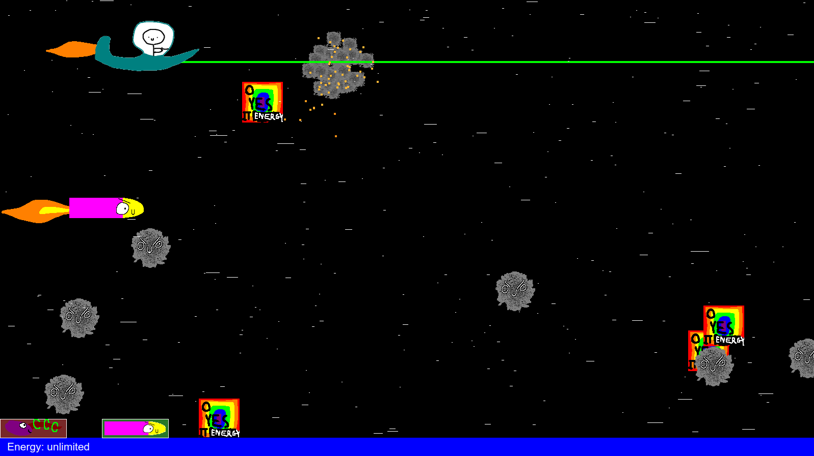

# rocket-dude
2D space shooter with a complete disregard for efficiency and realism



Loosely based on this: https://www.khanacademy.org/computer-programming/rocket-dude/5036049649369088

Instructions for how to get this running mostly for myself in the future for when I inevitably forget how this works, but also for anyone who wants to try it:

```bash
sudo apt-get install qt5-default

qmake rocketDude2.pro

make

./rocketDude2
```

WASD to move, A and D at the same time for turbo, up and down arrows to fire.
